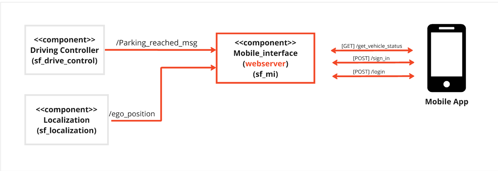
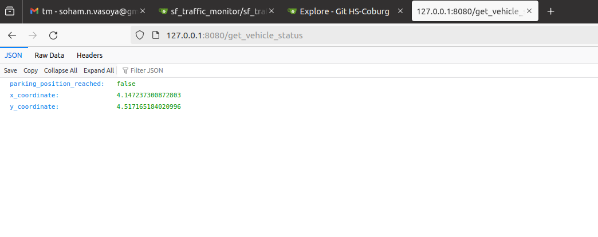
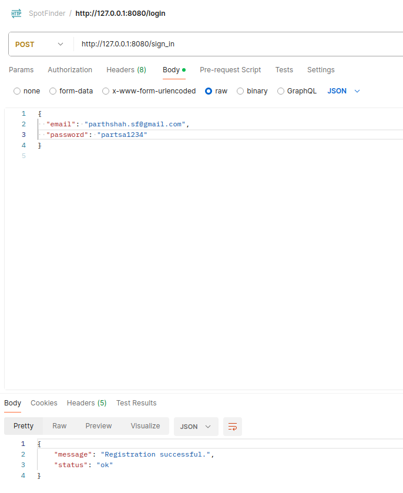
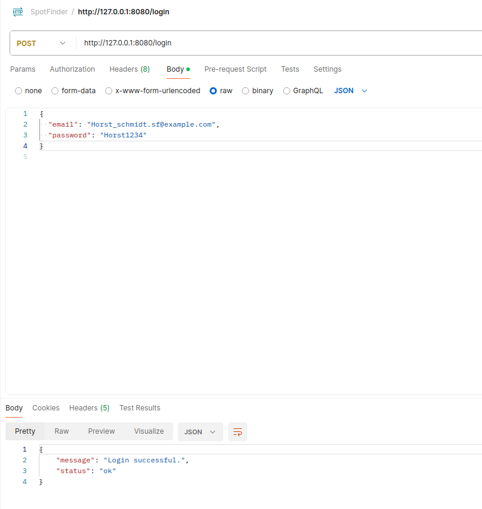

# Webserver

## Component Description

`Parth shah`

### Overview

The webserver is used to recieve get request from the android device , so it will process the request and return the response by visualising the requested data .The condition is for establishing the connection , IP address should be the same on both devices.We have used python flask and port 8080 in our webserver.

It is responding by giving output /get_vehicle_status which is visualising live x-y coordinates of the ego vehicle and parking status on the ip address which is also provided in output. (It should be work globally on all IP addresses.)

### Component Architecture



### ROS2 Topics

| IN/Out | Topic Name                     | Message Type                     | Description                                         |
|--------|--------------------------------|----------------------------------|-----------------------------------------------------|
| Input  | /parking_reached_msg           | std_msgs/bool                    | confirmation for each available parking spots       |
| Input  | /ego_position                  | sf_msgs/msg/EgoPosition          | Real-time ego vehicle's coordinates                 |
 
### Functionality

 Updates /get_vehicle_status that includes parking status and position coordinates of the ego vehicle.Access post requests for sign_in and login. New user data will automatically added to the database. Sends a notification to confirm successful parking.

### http requests

1. [GET]'127.0.0.1:8080/get_vehicle_status'
2. [POST]'127.0.0.1:8080/sign_in'
3. [POST]'127.0.0.1:8080/login'



 



### Requirements

### Dependencies

1. [sf_msgs](https://github.com/Team-SpotFinder/sf_msgs.git).
2. [sf_driving_controller](https://github.com/Team-SpotFinder/sf_driving_controller.git)
3. [std_msgs](https://github.com/ros2/common_interfaces/tree/rolling/std_msgs)
4. [sf_localization](https://github.com/Team-SpotFinder/sf_localization.git)


### Installation

This repository needs to be cloned, built and sourced. It needs to be cloned to `/src` folder of the ROS2 workspace. This can be done by following the instruction provided in the [sf_master](https://github.com/Team-SpotFinder/sf_master.git).

### Run Steps

1. Run the `sf_driving_controller` node by using the following command.

``` bash
ros2 run sf_driving_controller driving_controller
```
2. Run the `sf_localization` node by using the following command.
``` bash
ros2 run sf_localization sf_ego_localization
```

3. Run the `sf_mi` node by using the following command.

``` bash
ros2 run sf_mi sf_mi
```

# Mobile app

## Component Description

`Felix Ebert`

### Overview

The mobile is a application which cann be installed on every mobile phone running on android version 8.0 or higher. The Mobile-app is an interface between the user and spotfinder and will provide the most important informations to the user when he left his vehicle.  These informations include the current position of the Vehicle and a pop up notification which will be received as soon as the vehicle has reached its parking position. It also provides basic functionalities like a login and sing in.

### Architecture


### Http Request
1. Request to login
adress: ip_adress/login
type: Post
interval: event driven
request:
{
 email: email_adress,
 password: password
}
response: -

2. Request to sing in
adress: ip_adress/sign_in
type: Get
interval: event driven
request: 
{
 email: email_adress,
 password: password
}
response: -

3. Requesting Vehicle status
adress: ip_adress/get_vehicle_status
type: Get
interval: 1 hz
request: -
response:
{
 parking_position_reached : bool,
 x_coordinate : float,
 y_coordinate : float,
}

### Functionality

1. Login

* The User can login using a email andress and a password
* 

2. Sign in

* If the used doesnt have a account he can sign in with his email adress and password
* 

3. Visualizing the position of the Vehicle

* The position of the vehicle can be visualized when a connection to the webserver is established.
* 

4. Notifying the user

* The user can be notifified with a push notification as soon as the vehicle reached the parking spot
* 

### Dependencies

Android 8.0 or higher

internet connection [optional]

### Installation

1. download the apk from [spotfinder apk](SpotFinder/spotfinder.apk)
2. execute the apk
3. follow the installation instructions

### Run Steps

1. Go to app-settings and allow notifications.
2. Start the app by clicking on the app symbol
